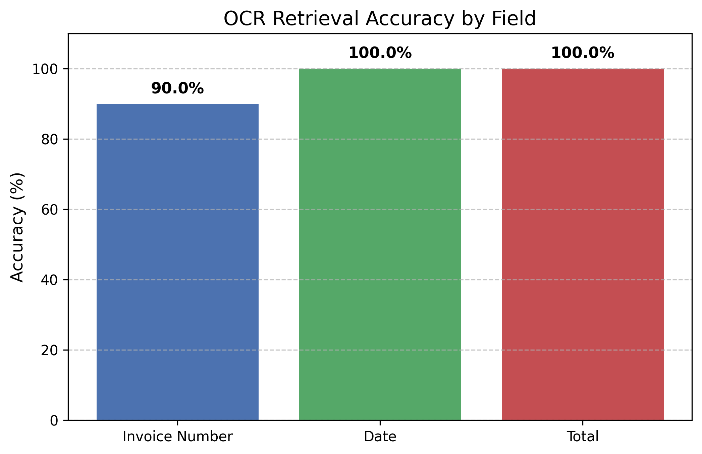

## Thank you to everyone for starring my repo! I'll do my best to extend the functionality regularly and fix things if people find problems.

# Curiosity AI Scans

A streamlined Streamlit app that uses local OCR and AI vision models to analyze images and PDFs. Upload multiple files, choose an OCR backend/profile, get detailed descriptions or extract structured fields, and export results plus evidence for review.

## What’s New

- Modular architecture: core pipeline, adapters, and UI components fully separated
- Immutable `PromptConfig` threaded through the pipeline — no more global prompt state (safe under CLI concurrency)
- Typed `Result` model and a single unified exporter (CSV, structured CSV, JSONL)
- Central `Settings` dataclass with environment‑variable overrides (`LOCALOCR_*`)
- Hardened Ollama adapter: exact‑match model resolution, TTL‑cached model listing, typed errors (`ModelUnavailable`, `ParseError`, `PDFError`), and streaming support
- Structured logging via `core/logging.py`
- Per‑file status chips (done/error) in the Streamlit UI
- Session‑isolated results in Streamlit (safe for shared deployments)
- Robust JSON extraction from model outputs (fenced blocks, brace scanning, heuristics)
- Advanced model options in the sidebar (temperature, top‑p, max tokens, context length)
- Optional system prompt, adjustable image resize, JPEG quality, PDF render scale
- Each item shows the actual model input size (WxH) and encoded JPEG size in KB
- OCR backend routing for Ollama, optional Docling, hybrid Docling+Ollama, and auto mode
- Built-in document profiles for generic documents, invoices, receipts, and tables
- Preprocessing presets for no-op, document cleanup, and high-accuracy scans
- Evidence JSON exports and evaluator metrics JSON for backend/profile/preprocess comparisons

## What this application does

- Upload multiple images (JPG, PNG) and PDF documents
- Choose Gemma 4, Gemma 3 12B, Llama 3.2 Vision, Granite 3.2 Vision, or your own local model
- Select the OCR backend: Ollama vision, optional local Docling OCR, hybrid Docling text with Ollama extraction, or auto routing
- Apply document profiles and preprocessing presets to keep field extraction runs consistent
- Get detailed descriptions or extract custom fields (invoice no., dates, amounts, etc.)
- Process PDF files page-by-page or as a single document
- Export results as standard CSV, structured CSV, JSONL, and detailed evidence JSON

The app uses Streamlit for the interface, Ollama for local model serving, Pillow for image processing, and PyMuPDF for PDF pages. Docling is optional and stays out of the base install. The runtime is split into focused modules for the UI, CLI, processing pipeline, exports, settings, profiles, preprocessing, and OCR adapters.

## Installation and setup

### Step 1: Install Ollama

#### Linux
```bash
curl -fsSL https://ollama.com/install.sh | sh
```

#### macOS
```bash
brew install ollama
# Or download from https://ollama.com/download
```

#### Windows
1. Download the installer from https://ollama.com/download
2. Run the installer and follow the instructions

### Step 2: Pull a vision model

```bash
# Gemma 4 (all flavours)
ollama pull gemma4:latest
ollama pull gemma4:e4b
ollama pull gemma4:e2b
ollama pull gemma4:26b
ollama pull gemma4:31b

# Gemma 3 Vision
ollama pull gemma3:12b

# Llama 3.2 Vision
ollama pull llama3.2-vision

# Granite 3.2 Vision (smaller footprint)
ollama pull granite3.2-vision

# DeepSeek OCR
ollama pull deepseek-ocr
```

Pull one or more — the app works with whichever you have installed.

### Step 3: Python environment

Use Python 3.10–3.13 for best compatibility with the current dependency set.

```bash
# Create a virtual environment
python -m venv venv

# Activate it
# macOS/Linux
source venv/bin/activate
# Windows (PowerShell)
venv\Scripts\Activate.ps1
# Windows (CMD)
venv\Scripts\activate.bat

# Install dependencies
pip install -c constraints.txt -r requirements.txt
```

For contribution work, install the development tools with the same constraints
file so local checks match CI:

```bash
pip install -c constraints.txt -r requirements-dev.txt
make check
```

`constraints.txt` pins the verified runtime, development, and stable transitive
dependency set. Python-specific compiled transitive packages are resolved per
interpreter. CI installs through this file on Python 3.10, 3.11, 3.12, and 3.13
before running `make check`; the Ollama-backed evaluation runs only once on
Python 3.11 to keep the workflow practical.

### Optional Docling backend

Docling is intentionally separate from the base install so the default Ollama
workflow stays lightweight:

```bash
source venv/bin/activate
pip install -r requirements-docling.txt
```

Docling conversion is local-only in this project. The adapter disables remote
services and requires pre-downloaded model artifacts. Download both the standard
Docling pipeline artifacts and the RapidOCR artifacts into one shared root:

```bash
mkdir -p /yourfolder/docling_artifacts

# Required for Docling's standard PDF/layout pipeline, including model.safetensors.
./venv/bin/docling-tools models download \
  --output-dir /yourfolder/docling_artifacts

# Required for the RapidOCR OCR engine used by scanned/image-heavy documents.
./venv/bin/docling-tools models download rapidocr \
  --output-dir /yourfolder/docling_artifacts

export DOCLING_ARTIFACTS_PATH=/yourfolder/docling_artifacts
```

If a previous partial download left the directory incomplete, rerun the two
download commands with `--force`.

`DOCLING_ARTIFACTS_PATH` must point at the artifacts root, not a nested
`RapidOcr/...` folder. After download, these checks should pass:

```bash
test -f /yourfolder/docling_artifacts/model.safetensors
test -f /yourfolder/docling_artifacts/RapidOcr/torch/PP-OCRv4/det/ch_PP-OCRv4_det_mobile.pth
```

If either check fails, the matching artifact set was not downloaded into the
directory used by `DOCLING_ARTIFACTS_PATH`. If `DOCLING_ARTIFACTS_PATH` is
missing or not a directory, Docling runs fail with a clear setup message instead
of silently using remote services.

## Running the application

1. Start Ollama if not already running
   ```bash
   ollama serve
   ```
   - Windows: Ollama typically runs as a service after installation. If you get connection errors, run the command above in a new terminal.
2. Launch the app
   ```bash
   streamlit run app.py
   ```
3. Open your browser to http://localhost:8501 if it doesn’t auto‑open.

## CLI usage (headless)

You can now process files without the UI:

```bash
python cli.py \
  --model gemma4:latest \
  --mode extract \
  --fields "Invoice number, Date, Total amount" \
  --ocr-backend auto \
  --profile invoice \
  --preprocess high-accuracy-scan \
  --pdf-pages \
  --pdf-scale 1.5 \
  --templates templates.json \
  --schema schema.json \
  --max-concurrency 2 \
  --rate-limit 0.5 \
  --out-results results.csv \
  --out-structured structured.csv \
  --out-evidence evidence.json \
  samples/invoice1.pdf samples/receipt.png
```

- `--mode description|extract`: general description vs extracting specific fields
- `--fields`: comma‑separated field names (for extract mode)
- `--ocr-backend ollama|docling|hybrid|auto`: default Ollama vision, Docling OCR/layout, Docling text plus Ollama extraction, or PDF-aware auto routing
- `--profile generic|invoice|receipt|table`: built-in field defaults and preprocessing defaults
- `--preprocess none|document-clean|high-accuracy-scan`: override the profile preprocessing default
- `--pdf-pages`: split PDFs so each page is processed and exported separately
- `--pdf-scale`: adjust render DPI before OCR (higher values sharpen text but take longer)
- `--max-concurrency`: number of files to process in parallel
- `--rate-limit`: requests per second (0 = unlimited)
- `--out-evidence`: write detailed OCR text, blocks, field evidence, backend, profile, and preprocessing metadata
- Also available: temperature, top‑p, tokens, context, max image size, JPEG quality, and PDF scale

Templates JSON example:

```json
{
  "description": "Describe the image focusing on text and layout.",
  "extraction": "Extract these fields from the image: {fields}. Return strict JSON."
}
```

Schema JSON example:

```json
{
  "fields": ["Invoice number", "Date", "Company name", "Total amount"]
}
```

## Features

- Multiple file uploads (images and PDFs)
- General description or custom field extraction
- OCR backend modes: Ollama, Docling, hybrid, and auto
- Document profiles: generic, invoice, receipt, and table
- Preprocessing presets: none, document cleanup, and high-accuracy scan
- Advanced Model Options:
  - Temperature, top‑p, max tokens (`num_predict`), context length (`num_ctx`)
  - System prompt (optional)
- Adjustable image resize and JPEG quality
- PDF render scale (pre‑rendering DPI via scale multiplier)
- PDF processing per page or first page only
- CSV, structured CSV, JSONL, and evidence JSON export paths
- Processing time shown under each item and as a batch summary
- Appearance controls: compact results view and show/hide thumbnails
- Headless CLI with optional concurrency and rate limiting

## Evaluation

Run the evaluator against `eval_dataset/ground_truth.json` with the same backend,
profile, and preprocessing path used by the CLI/UI:

```bash
python evaluate.py \
  --ocr-backend hybrid \
  --profile invoice \
  --preprocess high-accuracy-scan \
  --out-evidence eval_evidence.json \
  --metrics-json eval_metrics.json
```

- `--metrics-json`: writes deterministic metrics with run metadata, field counts, aggregate accuracy, backend/profile/preprocess group metrics, detailed rows, and evidence path
- `--out-evidence`: writes the same evidence JSON shape as the CLI/UI exporter
- `--allow-mock`: uses deterministic mock `Result` objects when Ollama is unavailable; mock runs never update the README
- `--update-readme`: opt in to refreshing the automated evaluation block below; default evaluation runs do not mutate `README.MD`
- `--chart-output` and `--detailed-csv`: override the default `eval_results.png` and `eval_detailed_results.csv` artifact paths

## Design Language

The app follows a minimalist, contemporary design that emphasizes clarity and progressive disclosure. Primary actions use a single accent color; advanced settings live in collapsible panels; results are easy to scan with soft dividers and compact metadata.

- Two‑pane layout: inputs in the sidebar, results in the main area
- Accent color for primary actions only; otherwise neutral surfaces
- Card‑like result grouping with clear captions for time, size, dimensions
- JSON details shown inside a collapsible expander to reduce noise
- Optional compact mode and ability to hide thumbnails

Keep UI changes aligned with this design language so the scanning flow stays compact and easy to operate.

## Project structure

After modularization, the repo is organized as:

- `core/` — image/PDF processing and extraction pipeline
- `adapters/` — external service adapters (Ollama and optional Docling)
- `ui/` — Streamlit UI helpers (export panel)
- `utils/` — shared types and small utilities
- `cli.py` — Headless batch processor
- `tests/` — Unit tests for JSON extraction and PDF conversion

Run tests with pytest:

```bash
pytest -q
```

## Advanced model options

Open the “Advanced Model Options” expander in the sidebar to configure:

- System prompt: steer the model with an instruction
- Temperature and top‑p: control creativity and sampling
- Max tokens (`num_predict`): cap the number of generated tokens
- Context length (`num_ctx`): increase when prompts + images are large
- Max image dimension and JPEG quality: balance speed and fidelity
- PDF render scale: changes the PDF page rasterization resolution before resizing

### Appearance

- Compact results view: condenses spacing and uses smaller thumbnails
- Show images: toggle thumbnails on/off in results

## Performance tips

- The largest impact on latency typically comes from generation length. Reduce “Max tokens (`num_predict`)” for faster responses.
- For PDFs, lowering the PDF render scale can significantly reduce pixels processed.
- Lower “Max image dimension (px)” reduces pixels; quality mostly affects encoded file size and decode cost (smaller effect than pixels or tokens).
- If running on CPU, expect slower times. GPU acceleration (where available) and quantized models often help.

## Troubleshooting

- Ollama not running: start with `ollama serve`
- Model not found: pull it with `ollama pull <model_name>`. The app tries to detect installed models and will proceed even if it can’t confirm; failures will include a concrete error message.
- PDF support missing: install PyMuPDF — `pip install pymupdf`
- Docling missing `model.safetensors`: run `./venv/bin/docling-tools models download --output-dir /yourfolder/docling_artifacts` and set `DOCLING_ARTIFACTS_PATH=/yourfolder/docling_artifacts`
- Docling missing `RapidOcr/.../*.pth`: run `./venv/bin/docling-tools models download rapidocr --output-dir /yourfolder/docling_artifacts`; `DOCLING_ARTIFACTS_PATH` should still point to the artifacts root, not the `RapidOcr` subfolder
- Python compatibility: prefer Python 3.10–3.13
- Long or complex prompts: if hitting context limits, increase `num_ctx`

---

Made with ❤️ by Adrian — [curiosityai.nl](https://curiosityai.nl)

## Automated Evaluation Results

This project includes an automated evaluation pipeline validating extraction accuracy against a ground truth dataset of invoices.

### Accuracy by Field

| Field | Accuracy |
|-------|----------|
| Invoice Number | 20.0% |
| Date | 60.0% |
| Total | 60.0% |



*(Run `python evaluate.py --update-readme` to regenerate these README metrics and chart)*
